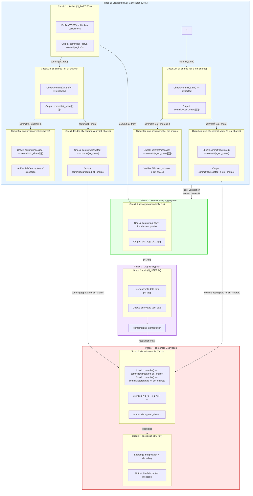
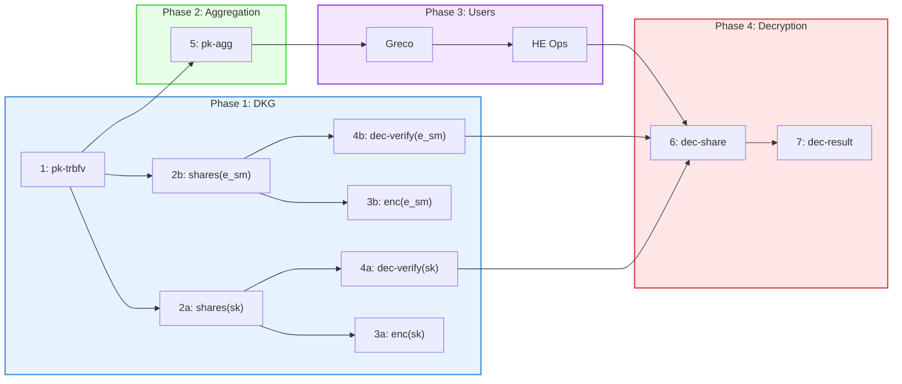
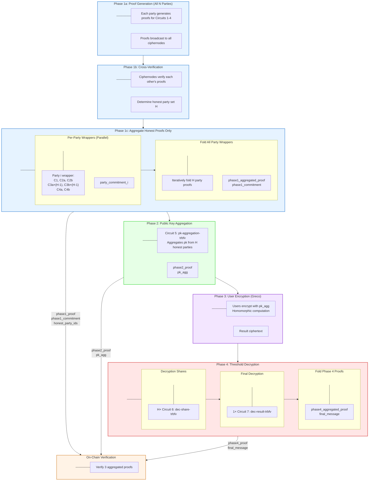

# PVSS-TRBFV Circuit Architecture

## Overview

The PVSS-TRBFV protocol consists of 4 phases:
- **Phase 1**: Distributed Key Generation (DKG)
- **Phase 2**: Honest Party Aggregation
- **Phase 3**: User Encryption (Greco)
- **Phase 4**: Threshold Decryption

## Circuit Flow Diagram


## Phase Summary

### Phase 1: Distributed Key Generation (DKG)
**Participants:** N_PARTIES ciphernodes

| Step | Circuit | Description |
|------|---------|-------------|
| 1 | Circuit 1: pk-trbfv | Each party generates TRBFV keypair |
| 2 | Circuit 2a/2b: sk-shares | Secret key/smudging noise shamir secret sharing with Reed-Solomon verification |
| 3 | Circuit 3a/3b: enc-bfv | Encrypt shares to other parties |
| 4 | Circuit 4a/4b: dec-bfv-commit-verify | Verify decryption matches commitments from circuit 2 |

### Phase 2: Honest Party Aggregation
**Participants:** Aggregator (any party or external)

| Step | Circuit | Description |
|------|---------|-------------|
| 1 | - | Verify Phase 1 proofs, identify honest parties H |
| 2 | Circuit 5: pk-aggregation-trbfv | Aggregate TRBFV public keys of honest parties |

### Phase 3: User Encryption (Greco)
**Participants:** N_USERS (external users)

| Step | Circuit | Description |
|------|---------|-------------|
| 1 | Greco | Users encrypt data with aggregated public key |
| 2 | - | Homomorphic computations on encrypted data |

### Phase 4: Threshold Decryption
**Participants:** T+1 honest ciphernodes

| Step | Circuit | Description |
|------|---------|-------------|
| 1 | Circuit 6: dec-share-trbfv | Each party computes decryption share |
| 2 | Circuit 7: dec-result-trbfv | Combine shares via Lagrange interpolation |

## Circuit Summary Table

| Circuit | Name | Instances | Phase | Input Commitments | Output |
|---------|------|-----------|-------|-------------------|--------|
| 1 | pk-trbfv | N_PARTIES | 1 | - | commit(sk_trbfv), commit(pk_trbfv) |
| 2a | sk-shares (sk) | 1 | 1 | commit(sk_trbfv) | commit(sk_share[i][j]) |
| 2b | sk-shares (e_sm) | 1 | 1 | commit(e_sm) | commit(e_sm_share[i][j]) |
| 3a | enc-bfv (sk) | N_PARTIES × L | 1 | commit(sk_share[i][j]) | ciphertexts |
| 3b | enc-bfv (e_sm) | N_PARTIES × L | 1 | commit(e_sm_share[i][j]) | ciphertexts |
| 4a | dec-bfv-commit-verify (sk) | H | 1 | commit(sk_share) | commit(aggregated_sk_shares) |
| 4b | dec-bfv-commit-verify (e_sm) | H | 1 | commit(e_sm_share) | commit(aggregated_e_sm_shares) |
| 5 | pk-aggregation-trbfv | 1 | 2 | commit(pk_trbfv) | pk0_agg, pk1_agg |
| - | Greco | N_USERS | 3 | pk_agg | encrypted data |
| 6 | dec-share-trbfv | T+1 | 4 | commit(agg_sk), commit(agg_e) | decryption_share d |
| 7 | dec-result-trbfv | 1 | 4 | decryption_shares | final message |

## Commitment Flow
```
Phase 1 (DKG):
  Circuit 1 ──→ commit(sk_trbfv) ──→ Circuit 2a
           ──→ commit(e_sm) ──────→ Circuit 2b
           ──→ commit(pk_trbfv) ─────────────────────→ Circuit 5 (Phase 2)

  Circuit 2a ──→ commit(sk_share[i][j]) ──→ Circuit 3a
                                       ──→ Circuit 4a

  Circuit 2b ──→ commit(e_sm_share[i][j]) ──→ Circuit 3b
                                          ──→ Circuit 4b

  Circuit 4a ──→ commit(aggregated_sk_shares) ──────→ Circuit 6 (Phase 4)
  Circuit 4b ──→ commit(aggregated_e_sm_shares) ────→ Circuit 6 (Phase 4)

Phase 2 (Aggregation):
  Circuit 5 ──→ pk_agg ──→ Greco (Phase 3)

Phase 3 (User Encryption):
  Greco ──→ ciphertext ──→ Homomorphic Ops ──→ result_ciphertext ──→ Circuit 6 (Phase 4)

Phase 4 (Decryption):
  Circuit 6 ──→ decryption_share d ──→ Circuit 7
  Circuit 7 ──→ final_message
```

## Simplified Linear Flow


## Security Properties

1. **Threshold Security**: Need T+1 honest parties to decrypt
2. **Verifiable**: All operations proven in zero-knowledge
3. **Composition**: Commitments chain circuits together
4. **Dishonest Detection**: Phase 1 proofs identify malicious parties before Phase 2

# Proof Aggregation Architecture

## Overview

The PVSS-TRBFV protocol uses recursive proof aggregation to minimize on-chain verification costs. Instead of posting all individual proofs on-chain, proofs are aggregated into constant-size proofs regardless of the number of parties.

## Aggregation Flow


## Proof Counts

### Per-Party Proofs (Phase 1)

| Circuit | Description | Count per Party |
|---------|-------------|-----------------|
| C1 | pk-trbfv | 1 |
| C2a | sk-shares | 1 |
| C2b | e_sm-shares | 1 |
| C3a | enc-bfv (sk) to other honest parties | H - 1 |
| C3b | enc-bfv (e_sm) to other honest parties | H - 1 |
| C4a | dec-bfv-commit-verify (sk) | 1 |
| C4b | dec-bfv-commit-verify (e_sm) | 1 |
| **Total per party** | | **2H + 3** |

### Total Proof Counts

| Phase | Circuit | Count | Formula |
|-------|---------|-------|---------|
| 1 | C1: pk-trbfv | H | H |
| 1 | C2a: sk-shares | H | H |
| 1 | C2b: e_sm-shares | H | H |
| 1 | C3a: enc-bfv (sk) | H × (H-1) | H² - H |
| 1 | C3b: enc-bfv (e_sm) | H × (H-1) | H² - H |
| 1 | C4a: dec-verify (sk) | H | H |
| 1 | C4b: dec-verify (e_sm) | H | H |
| **Phase 1 Total** | | | **2H² + 3H** |
| 2 | C5: pk-aggregation | 1 | 1 |
| 4 | C6: dec-share | H | H |
| 4 | C7: dec-result | 1 | 1 |
| **Grand Total** | | | **2H² + 4H + 2** |

## Aggregation Layers
```
Layer 0: Original Circuit Proofs
         ┌─────────────────────────────────────────────────────────┐
         │  H × (2H + 3) proofs for Phase 1                       │
         │  H proofs for Phase 4 (C6)                             │
         │  1 proof each for C5, C7                               │
         └─────────────────────────────────────────────────────────┘
                                    │
                                    ▼
Layer 1: Per-Party Wrapper Proofs
         ┌─────────────────────────────────────────────────────────┐
         │  Each honest party aggregates their own proofs          │
         │  H wrapper proofs (parallel)                           │
         │                                                         │
         │  party_wrapper_1 ─┐                                     │
         │  party_wrapper_2 ─┼── commitment_i for each party      │
         │  ...              │                                     │
         │  party_wrapper_H ─┘                                     │
         └─────────────────────────────────────────────────────────┘
                                    │
                                    ▼
Layer 2: Fold All Party Wrappers
         ┌─────────────────────────────────────────────────────────┐
         │  Iteratively fold H party proofs into one              │
         │                                                         │
         │  fold(empty, wrapper_1) → acc_1                        │
         │  fold(acc_1, wrapper_2) → acc_2                        │
         │  fold(acc_2, wrapper_3) → acc_3                        │
         │  ...                                                    │
         │  fold(acc_{H-1}, wrapper_H) → phase1_aggregated_proof  │
         └─────────────────────────────────────────────────────────┘
                                    │
                                    ▼
Layer 3: On-Chain (Constant Size)
         ┌─────────────────────────────────────────────────────────┐
         │  phase1_aggregated_proof + phase1_commitment           │
         │  phase2_proof + pk_agg                                 │
         │  phase4_aggregated_proof + final_message               │
         └─────────────────────────────────────────────────────────┘
```

## Wrapper Circuit Structure

### Per-Party Wrapper (Phase 1)
```
┌─────────────────────────────────────────────────────────────────┐
│                    Party Wrapper Circuit                        │
│                                                                 │
│  Private Inputs:                                                │
│    ├── proof_c1, proof_c2a, proof_c2b                          │
│    ├── proofs_c3a[H-1], proofs_c3b[H-1]                        │
│    ├── proof_c4a, proof_c4b                                    │
│    ├── verification_keys (vk_c1, vk_c2, vk_c3, vk_c4)         │
│    └── public_inputs for each circuit                          │
│                                                                 │
│  Logic:                                                         │
│    1. Verify each original proof                               │
│    2. Compute commitment to all public inputs                  │
│                                                                 │
│  Public Output:                                                 │
│    └── party_commitment (single Field)                         │
└─────────────────────────────────────────────────────────────────┘
```

### Fold Circuit (Dynamic H)
```
┌─────────────────────────────────────────────────────────────────┐
│                    Fold Circuit                                 │
│                                                                 │
│  Private Inputs:                                                │
│    ├── acc_proof (accumulated proof so far)                    │
│    ├── acc_commitment                                          │
│    ├── new_proof (next party's wrapper proof)                  │
│    ├── new_commitment                                          │
│    └── wrapper_vk                                              │
│                                                                 │
│  Logic:                                                         │
│    1. Verify acc_proof (if not first iteration)               │
│    2. Verify new_proof                                         │
│    3. Combine commitments: hash(acc_commitment, new_commitment)│
│                                                                 │
│  Public Output:                                                 │
│    └── combined_commitment (single Field)                      │
└─────────────────────────────────────────────────────────────────┘
```

### Phase 4 Wrapper
```
┌─────────────────────────────────────────────────────────────────┐
│                    Phase 4 Wrapper Circuit                      │
│                                                                 │
│  Private Inputs:                                                │
│    ├── proofs_c6[H] (decryption share proofs)                  │
│    ├── proof_c7 (final decryption proof)                       │
│    ├── verification_keys (vk_c6, vk_c7)                        │
│    └── public_inputs for each circuit                          │
│                                                                 │
│  Logic:                                                         │
│    1. Verify all H decryption share proofs (C6)               │
│    2. Verify final decryption proof (C7)                       │
│    3. Compute commitment to all public inputs                  │
│                                                                 │
│  Public Outputs:                                                │
│    ├── phase4_commitment (single Field)                        │
│    └── final_message                                           │
└─────────────────────────────────────────────────────────────────┘
```

## On-Chain Verification

### Data Posted On-Chain

| Phase | Proof | Public Data | Size |
|-------|-------|-------------|------|
| 1 | phase1_proof | phase1_commitment, honest_party_ids | Constant + O(H) |
| 2 | phase2_proof | phase2_commitment, pk_agg | Constant |
| 4 | phase4_proof | phase4_commitment, final_message | Constant |

### Verification Flow
```mermaid
flowchart LR
    subgraph OnChain["On-Chain Verifier"]
        direction TB
        OC_pad[" "]
        
        V1["Verify phase1_proof"]
        V2["Verify phase2_proof"]
        V4["Verify phase4_proof"]
        
        Check["Check commitment linkage"]
        Result["Accept/Reject"]
        
        OC_pad --- V1
        V1 --> V2
        V2 --> V4
        V4 --> Check
        Check --> Result
    end

    P1["phase1_proof<br/>phase1_commitment"] --> V1
    P2["phase2_proof<br/>pk_agg"] --> V2
    P4["phase4_proof<br/>final_message"] --> V4

    style OC_pad fill:none,stroke:none,color:transparent
    style OnChain fill:#fff3e6,stroke:#d9944a,stroke-width:2px

