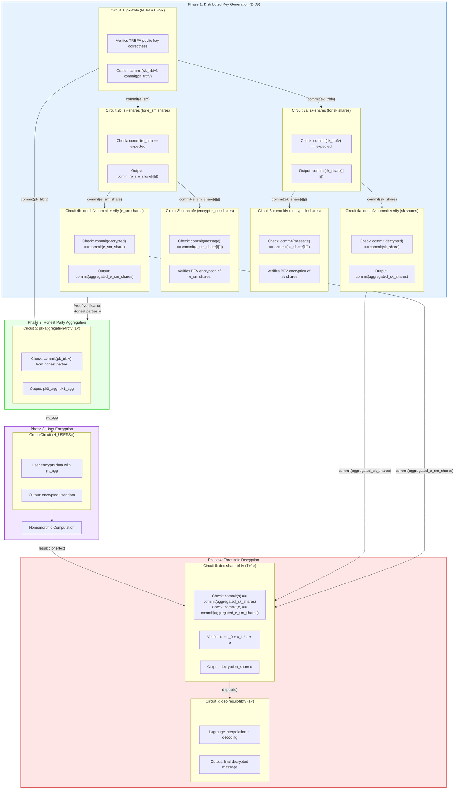
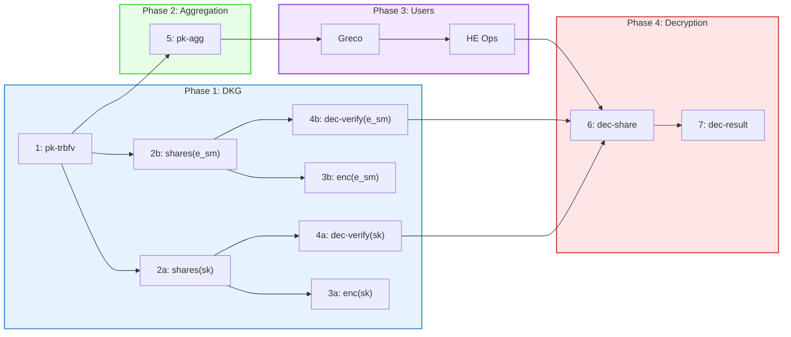

# PVSS-TRBFV Circuit Architecture

## Overview

The PVSS-TRBFV protocol consists of 4 phases:
- **Phase 1**: Distributed Key Generation (DKG)
- **Phase 2**: Honest Party Aggregation
- **Phase 3**: User Encryption (Greco)
- **Phase 4**: Threshold Decryption

## Circuit Flow Diagram


## Phase Summary

### Phase 1: Distributed Key Generation (DKG)
**Participants:** N_PARTIES ciphernodes

| Step | Circuit | Description |
|------|---------|-------------|
| 1 | Circuit 1: pk-trbfv | Each party generates TRBFV keypair |
| 2 | Circuit 2a/2b: sk-shares | Secret key/smudging noise shamir secret sharing with Reed-Solomon verification |
| 3 | Circuit 3a/3b: enc-bfv | Encrypt shares to other parties |
| 4 | Circuit 4a/4b: dec-bfv-commit-verify | Verify decryption matches commitments from circuit 2 |

### Phase 2: Honest Party Aggregation
**Participants:** Aggregator (any party or external)

| Step | Circuit | Description |
|------|---------|-------------|
| 1 | - | Verify Phase 1 proofs, identify honest parties H |
| 2 | Circuit 5: pk-aggregation-trbfv | Aggregate TRBFV public keys of honest parties |

### Phase 3: User Encryption (Greco)
**Participants:** N_USERS (external users)

| Step | Circuit | Description |
|------|---------|-------------|
| 1 | Greco | Users encrypt data with aggregated public key |
| 2 | - | Homomorphic computations on encrypted data |

### Phase 4: Threshold Decryption
**Participants:** T+1 honest ciphernodes

| Step | Circuit | Description |
|------|---------|-------------|
| 1 | Circuit 6: dec-share-trbfv | Each party computes decryption share |
| 2 | Circuit 7: dec-result-trbfv | Combine shares via Lagrange interpolation |

## Circuit Summary Table

| Circuit | Name | Instances | Phase | Input Commitments | Output |
|---------|------|-----------|-------|-------------------|--------|
| 1 | pk-trbfv | N_PARTIES | 1 | - | commit(sk_trbfv), commit(pk_trbfv) |
| 2a | sk-shares (sk) | 1 | 1 | commit(sk_trbfv) | commit(sk_share[i][j]) |
| 2b | sk-shares (e_sm) | 1 | 1 | commit(e_sm) | commit(e_sm_share[i][j]) |
| 3a | enc-bfv (sk) | N_PARTIES × L | 1 | commit(sk_share[i][j]) | ciphertexts |
| 3b | enc-bfv (e_sm) | N_PARTIES × L | 1 | commit(e_sm_share[i][j]) | ciphertexts |
| 4a | dec-bfv-commit-verify (sk) | H | 1 | commit(sk_share) | commit(aggregated_sk_shares) |
| 4b | dec-bfv-commit-verify (e_sm) | H | 1 | commit(e_sm_share) | commit(aggregated_e_sm_shares) |
| 5 | pk-aggregation-trbfv | 1 | 2 | commit(pk_trbfv) | pk0_agg, pk1_agg |
| - | Greco | N_USERS | 3 | pk_agg | encrypted data |
| 6 | dec-share-trbfv | T+1 | 4 | commit(agg_sk), commit(agg_e) | decryption_share d |
| 7 | dec-result-trbfv | 1 | 4 | decryption_shares | final message |

## Commitment Flow
```
Phase 1 (DKG):
  Circuit 1 ──→ commit(sk_trbfv) ──→ Circuit 2a
           ──→ commit(e_sm) ──────→ Circuit 2b
           ──→ commit(pk_trbfv) ─────────────────────→ Circuit 5 (Phase 2)

  Circuit 2a ──→ commit(sk_share[i][j]) ──→ Circuit 3a
                                       ──→ Circuit 4a

  Circuit 2b ──→ commit(e_sm_share[i][j]) ──→ Circuit 3b
                                          ──→ Circuit 4b

  Circuit 4a ──→ commit(aggregated_sk_shares) ──────→ Circuit 6 (Phase 4)
  Circuit 4b ──→ commit(aggregated_e_sm_shares) ────→ Circuit 6 (Phase 4)

Phase 2 (Aggregation):
  Circuit 5 ──→ pk_agg ──→ Greco (Phase 3)

Phase 3 (User Encryption):
  Greco ──→ ciphertext ──→ Homomorphic Ops ──→ result_ciphertext ──→ Circuit 6 (Phase 4)

Phase 4 (Decryption):
  Circuit 6 ──→ decryption_share d ──→ Circuit 7
  Circuit 7 ──→ final_message
```

## Simplified Linear Flow


## Security Properties

1. **Threshold Security**: Need T+1 honest parties to decrypt
2. **Verifiable**: All operations proven in zero-knowledge
3. **Composition**: Commitments chain circuits together
4. **Dishonest Detection**: Phase 1 proofs identify malicious parties before Phase 2
