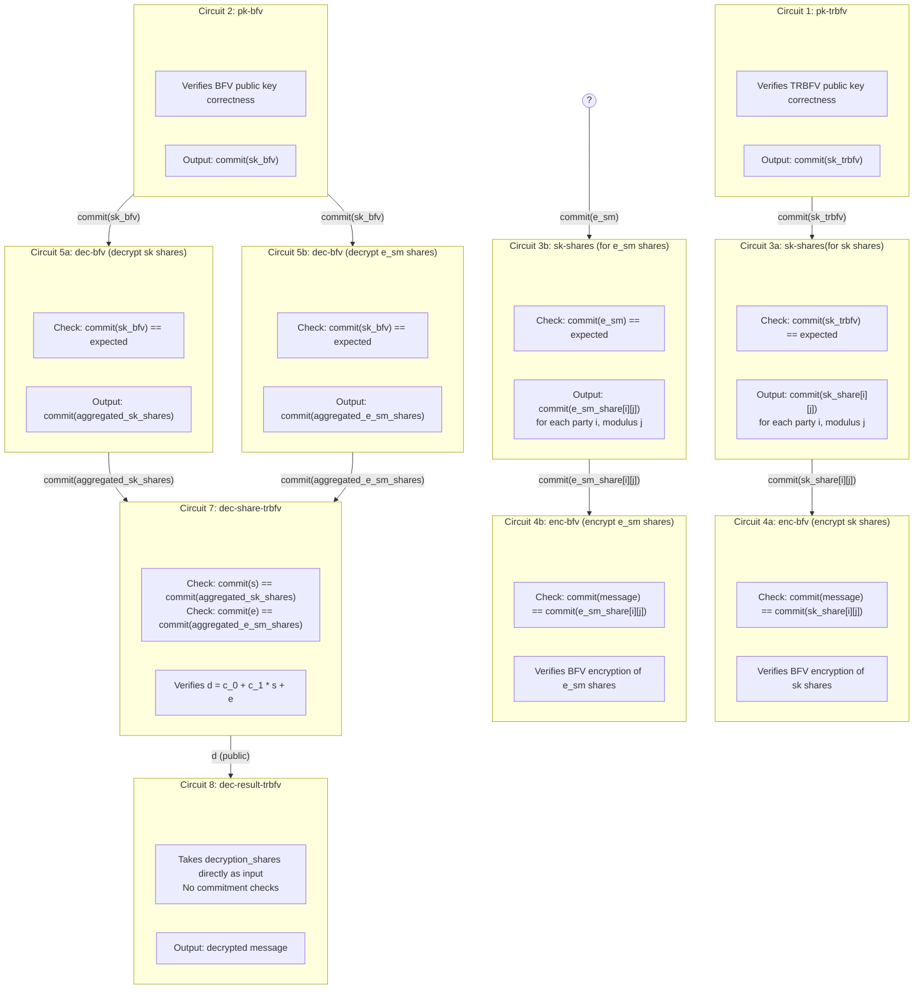
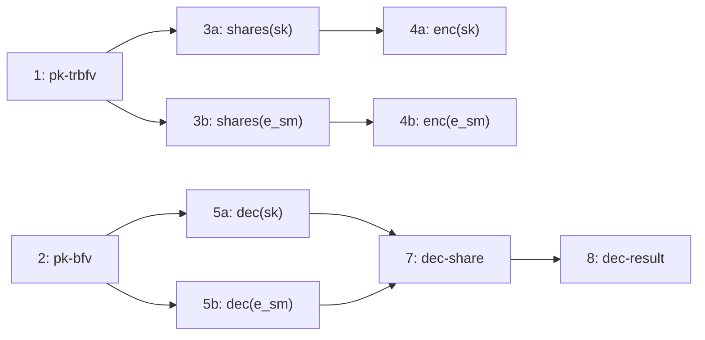

# PVSS-TRBFV Circuit Architecture

## Circuit Flow Diagram

## Circuit Summary Table

| Circuit | Name | Input Commitments | Equality Checks | Output Commitments |
|---------|------|-------------------|-----------------|-------------------|
| 1 | pk-trbfv | - | - | `commit(sk_trbfv)` |
| 2 | pk-bfv | - | - | `commit(sk_bfv)` |
| 3a | sk-shares (sk) | `commit(sk_trbfv)` | `commit(sk_trbfv) == expected` | `commit(sk_share[i][j])` |
| 3b | sk-shares (e_sm) | `commit(e_sm)` | `commit(e_sm) == expected` | `commit(e_sm_share[i][j])` |
| 4a | enc-bfv (sk shares) | `commit(sk_share[i][j])` | `commit(message) == commit(sk_share[i][j])` | - |
| 4b | enc-bfv (e_sm shares) | `commit(e_sm_share[i][j])` | `commit(message) == commit(e_sm_share[i][j])` | - |
| 5a | dec-bfv (sk shares) | `commit(sk_bfv)` | `commit(sk_bfv) == expected` | `commit(aggregated_sk_shares)` |
| 5b | dec-bfv (e_sm shares) | `commit(sk_bfv)` | `commit(sk_bfv) == expected` | `commit(aggregated_e_sm_shares)` |
| 7 | dec-share-trbfv | `commit(s)`, `commit(e)` | `commit(s) == commit(aggregated_sk_shares)` `commit(e) == commit(aggregated_e_sm_shares)` | - |
| 8 | dec-result-trbfv | - | - | decrypted message |

## Simplified Linear Flow

